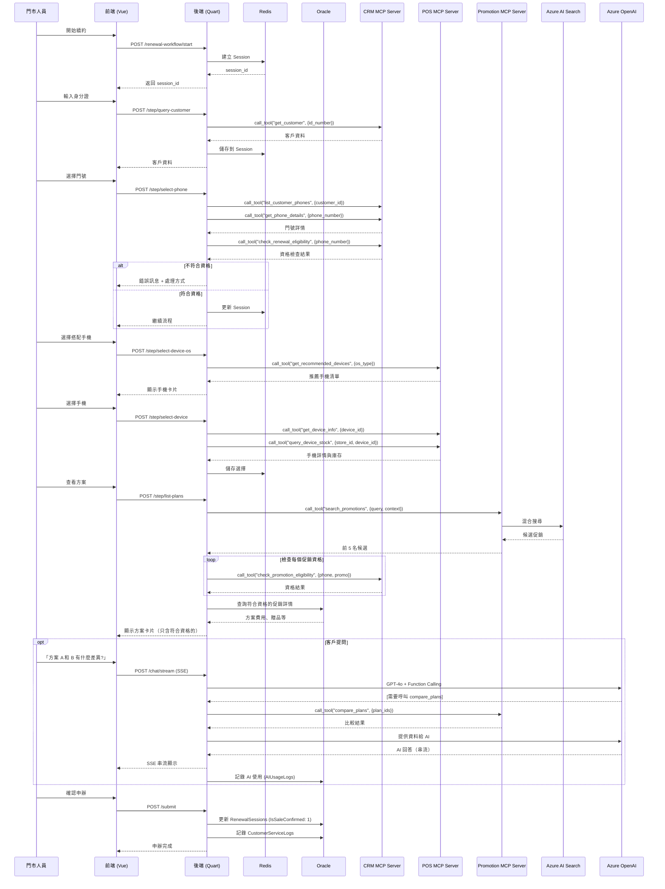

# 電信門市銷售助理系統 - 完整架構說明文件

## 目錄

1. [系統概述](#1-系統概述)
   - 1.1 系統目標
   - 1.2 核心價值
   - 1.3 使用者角色
2. [技術架構](#2-技術架構)
   - 2.1 系統架構圖
   - 2.2 技術堆疊明細
3. [核心功能模組](#3-核心功能模組)
   - 3.1 認證與授權模組
   - 3.2 續約工作流程模組
   - 3.3 AI 智能推薦模組
   - 3.4 統計追蹤模組
   - 3.5 MCP Server 架構設計
4. [資料流程](#4-資料流程)
   - 4.1 完整續約流程時序圖
   - 4.2 SSE 串流進度顯示
5. [安全與權限](#5-安全與權限)
   - 5.1 認證流程
   - 5.2 API 權限控制
   - 5.3 資料安全
6. [DevOps 敏捷迭代開發計畫](#6-devops-敏捷迭代開發計畫)
   - 6.1 開發原則
   - 6.2 完整迭代計畫 (Sprint 0-9)
   - 6.3 監控與告警
7. [API 端點總覽](#7-api-端點總覽)
   - 7.1 認證相關 API
   - 7.2 續約工作流程 API
   - 7.3 統計相關 API
   - 7.4 MCP Server Tools 總覽
8. [附錄](#附錄-a-mcp-server-開發最佳實踐)
   - 附錄 A：MCP Server 開發最佳實踐
   - 附錄 B：MCP Server 部署配置

***

## 1. 系統概述

### 1.1 系統目標

提供電信門市人員 AI 驅動的續約銷售輔助系統，透過智能推薦、自動化工作流程與即時統計，提升續約成功率與客戶滿意度。

### 1.2 核心價值

- ✅ **智能推薦**：基於客戶使用習慣與 RAG 檢索推薦最適方案
- ✅ **互動式流程**：10 步驟有狀態工作流程，引導門市人員完成續約
- ✅ **自由對話**：AI 助理隨時回答客戶問題
- ✅ **即時統計**：追蹤門市人員績效與 AI 使用情況
- ✅ **資格預檢**：提前過濾不符合條件的促銷，避免客戶期望落空


### 1.3 使用者角色

| 角色 | 權限 | 主要功能 |
| :-- | :-- | :-- |
| **門市人員** (Sales) | 基本 | 續約流程、AI 對話、查看個人統計 |
| **門市主管** (Manager) | 中級 | 門市人員管理、門市統計、排行榜 |
| **系統管理員** (Admin) | 完整 | 系統配置、所有門市統計、用戶管理 |


***

## 2. 技術架構

### 2.1 系統架構圖

```plaintext
┌─────────────────────────────────────────────────────────────────┐
│ 前端層 (Frontend)                                                │
│ ┌─────────────────────────────────────────────────────────────┐ │
│ │ Vue 3 + Nuxt 3 + Nuxt UI + Tailwind CSS                    │ │
│ │ ├─ 登入頁面                                                  │ │
│ │ ├─ 個人儀表板 (統計)                                         │ │
│ │ ├─ 續約工作流程頁面 (10 步驟)                                │ │
│ │ ├─ AI 自由對話介面                                           │ │
│ │ └─ 門市排行榜 (主管)                                         │ │
│ └─────────────────────────────────────────────────────────────┘ │
└────────────────────────┬────────────────────────────────────────┘
                         │ HTTP/REST + SSE
┌────────────────────────▼────────────────────────────────────────┐
│ 後端層 (Backend)                                                 │
│ ┌─────────────────────────────────────────────────────────────┐ │
│ │ Python + Quart (Async Web Framework)                       │ │
│ │ ├─ API 端點                                                 │ │
│ │ │  ├─ /api/auth/* (認證)                                    │ │
│ │ │  ├─ /api/renewal-workflow/* (續約流程)                    │ │
│ │ │  └─ /api/statistics/* (統計)                              │ │
│ │ ├─ 服務層                                                   │ │
│ │ │  ├─ AuthService (JWT + Redis)                            │ │
│ │ │  ├─ SessionManager (Redis)                               │ │
│ │ │  ├─ WorkflowOrchestrator (狀態機)                        │ │
│ │ │  ├─ MCPClientService (統一 MCP 客戶端管理)               │ │
│ │ │  ├─ EligibilityService (資格檢查)                        │ │
│ │ │  ├─ PromotionService (RAG + SQL)                         │ │
│ │ │  └─ StatisticsService (追蹤統計)                         │ │
│ │ └─ MCP Servers (核心功能)                                   │ │
│ │     ├─ CRM MCP Server (客戶資料管理)                        │ │
│ │     │  └─ Tools: get_customer, list_phones, check_contract │ │
│ │     ├─ POS MCP Server (庫存與設備管理)                      │ │
│ │     │  └─ Tools: query_device_stock, get_device_info      │ │
│ │     └─ Promotion MCP Server (促銷方案管理)                  │ │
│ │        └─ Tools: search_promotions, compare_plans         │ │
│ └─────────────────────────────────────────────────────────────┘ │
└────────────────────────┬────────────────────────────────────────┘
                         │
┌────────────────────────▼────────────────────────────────────────┐
│ 資料層 (Data Layer)                                              │
│ ┌──────────────┐  ┌──────────────┐  ┌─────────────────────┐   │
│ │ Redis        │  │ Oracle DB    │  │ Azure AI Search     │   │
│ │ ├─ Session   │  │ ├─ 人員資料  │  │ ├─ 促銷文件向量     │   │
│ │ ├─ Token     │  │ ├─ 統計資料  │  │ ├─ RAG 檢索         │   │
│ │ └─ Cache     │  │ └─ 續約記錄  │  │ └─ 混合搜尋 (RRF)   │   │
│ └──────────────┘  └──────────────┘  └─────────────────────┘   │
└─────────────────────────────────────────────────────────────────┘
                         │
┌────────────────────────▼────────────────────────────────────────┐
│ 外部整合層 (External Systems via MCP)                            │
│ ┌──────────────┐  ┌──────────────┐  ┌─────────────────────┐   │
│ │ CRM 系統     │  │ Azure OpenAI │  │ 門市 POS 系統       │   │
│ │ (via MCP)    │  │ ├─ GPT-4o    │  │ (via MCP)           │   │
│ │ ├─ 客戶資料  │  │ ├─ Embedding │  │ ├─ 庫存查詢         │   │
│ │ ├─ 合約資訊  │  │ └─ Streaming │  │ ├─ 設備資訊         │   │
│ │ └─ 使用量    │  │              │  │ └─ 價格資訊         │   │
│ └──────────────┘  └──────────────┘  └─────────────────────┘   │
└─────────────────────────────────────────────────────────────────┘
```


### 2.2 技術堆疊明細

#### 前端

```yaml
框架: Vue 3.4+ (Composition API)
路由: Nuxt 3.11+
UI框架: Nuxt UI v3 (Tailwind CSS)
狀態管理: Composables + Pinia
HTTP客戶端: $fetch (內建)
SSE: EventSource API
認證: Session ID + LocalStorage
```


#### 後端

```yaml
後端:
  Web框架: Quart 0.19+ (Async)
  ASGI Server: Hypercorn 0.17+
  ORM: 無 (使用原生 SQL)
  資料庫驅動: python-oracledb 2.0+
  Redis客戶端: redis-py 5.0+ (async)
  HTTP客戶端: httpx 0.27+ (async)
  AI整合: openai 1.54+
  搜尋整合: azure-search-documents 11.6+
  認證: Session + bcrypt 4.1+
  MCP整合: mcp 0.9.0+ (FastMCP)  # 新增

MCP Servers:
  框架: FastMCP
  通訊協議: stdio / SSE
  工具定義: JSON Schema
  錯誤處理: Structured Error Response
```


#### 資料庫

```yaml
主資料庫: Oracle 19c+ (人員、統計、續約記錄)
快取/Session: Redis 7.2+ (Standalone 或 Cluster)
向量搜尋: Azure AI Search (Standard S1)
```


#### AI/ML

```yaml
LLM: Azure OpenAI GPT-4o
Embedding: text-embedding-3-large (1536維)
RAG: Azure AI Search (HNSW + BM25 + RRF)
MCP: FastMCP (可選，自由對話)
```


***

## 3. 核心功能模組

### 3.1 認證與授權模組

#### 3.1.1 功能

- 門市人員登入/登出
- Session 管理（Redis 儲存）
- 登入狀態維護
- 登入記錄追蹤


#### 3.1.2 資料流程

```plaintext
登入流程：
1. 前端提交員工編號 + 密碼
2. 後端查詢 Oracle (Staff 表)
3. bcrypt 驗證密碼
4. 生成 Session ID
5. Session 存入 Redis (TTL: 8小時)
6. 記錄登入日誌 (Oracle LoginLogs 表)
7. 回傳 Session ID 給前端

認證中介軟體：
1. 前端每次請求帶上 Session ID (Cookie 或 Header)
2. 後端檢查 Redis 中 Session 是否存在
3. 檢查 Session 是否過期
4. 將用戶資訊注入到 request.user
```


#### 3.1.3 API 端點

```
POST   /api/auth/login          - 登入
POST   /api/auth/logout         - 登出
GET    /api/auth/me             - 取得當前使用者
POST   /api/auth/change-password - 變更密碼
```


### 3.2 續約工作流程模組

#### 3.2.1 10 步驟流程定義

```plaintext
┌──────────────────────────────────────────────────────────┐
│ Step 1: 輸入身分證，查詢客戶                              │
│ └─ 判斷：是否為本公司客戶？                              │
│    ├─ 否 → 委婉回覆「暫不提供新申辦」                    │
│    └─ 是 → 繼續                                          │
├──────────────────────────────────────────────────────────┤
│ Step 2-3: 顯示客戶門號清單（卡片）                        │
│ └─ 每個門號顯示：合約狀況、使用量、帳單                  │
├──────────────────────────────────────────────────────────┤
│ Step 4: 選擇門號，檢查續約資格                            │
│ ├─ 檢查：60天內到期？                                    │
│ ├─ 檢查：欠費？黑名單？信用評等？                        │
│ └─ 不符合 → 顯示原因與處理方式                          │
├──────────────────────────────────────────────────────────┤
│ Step 5: 選擇裝置類型                                      │
│ ├─ 選項 1: 不選擇裝置（單純續約）→ 跳到 Step 8          │
│ ├─ 選項 2: 智慧型手機（Smartphone）→ 繼續 Step 6         │
│ ├─ 選項 3: 平板（Tablet）→ 繼續 Step 6                   │
│ └─ 選項 4: 穿戴裝置（Wearable）→ 繼續 Step 6             │
│                                                            │
│ 🔓 從此步驟開始，客戶可自由提問（AI 助理）              │
├──────────────────────────────────────────────────────────┤
│ Step 6: 選擇手機作業系統（Android / iOS）                 │
│ └─ 顯示手機卡片，推薦機型用醒目標示                      │
├──────────────────────────────────────────────────────────┤
│ Step 7: 選擇手機與顏色                                    │
├──────────────────────────────────────────────────────────┤
│ Step 8: 顯示可選方案（卡片）                              │
│ └─ RAG 檢索 + 逐一檢查資格 → 只顯示符合條件的方案       │
├──────────────────────────────────────────────────────────┤
│ Step 9: 方案比較（可選）                                  │
│ └─ AI 生成比較表格與推薦理由                             │
├──────────────────────────────────────────────────────────┤
│ Step 10: 確認申辦                                         │
│ └─ 顯示總結資料（客戶、門號、手機、方案、費用）          │
└──────────────────────────────────────────────────────────┘
```


#### 3.2.2 狀態機設計

```python
# 狀態轉換規則
TRANSITIONS = {
    INIT: [QUERY_CUSTOMER],
    QUERY_CUSTOMER: [SELECT_PHONE],
    SELECT_PHONE: [CHECK_ELIGIBILITY],
    CHECK_ELIGIBILITY: [SELECT_DEVICE_TYPE],
    SELECT_DEVICE_TYPE: [SELECT_DEVICE, SELECT_PLAN],  # 分岔
    SELECT_DEVICE: [SELECT_PLAN],
    SELECT_PLAN: [COMPARE_PLANS, CONFIRM],
    COMPARE_PLANS: [SELECT_PLAN, CONFIRM],
    CONFIRM: [COMPLETED]
}

# 前置條件檢查
REQUIREMENTS = {
    QUERY_CUSTOMER: lambda s: s.id_number is not None,
    SELECT_PHONE: lambda s: s.customer_id is not None,
    CHECK_ELIGIBILITY: lambda s: s.selected_phone_number is not None,
    SELECT_DEVICE_TYPE: lambda s: s.eligibility_check is not None,
    SELECT_DEVICE: lambda s: s.device_os is not None,
    SELECT_PLAN: lambda s: (
        s.renewal_type == "single" or 
        s.selected_device is not None
    ),
    CONFIRM: lambda s: s.selected_plan is not None
}
```


#### 3.2.3 Session 管理（Redis）

```python
# Session 資料結構
{
    "session_id": "renewal_STAFF001_a1b2c3d4",
    "staff_id": "STAFF001",
    "current_step": "select_plan",
    "customer_selection": {
        "id_number": "A123456789",
        "customer_id": "C123456",
        "customer_name": "張三",
        "selected_phone_number": "0912345678",
        "renewal_type": "with_device",
        "selected_device": {...},
        "selected_plan": {...}
    },
    "created_at": "2025-10-08T12:00:00",
    "updated_at": "2025-10-08T12:15:00",
    "chat_history": [...]  # 自由對話記錄
}

# Redis Key 設計
session:{session_id}              → JSON (TTL: 1小時)
staff_sessions:{staff_id}         → Set (所有 session_id)
```


#### 3.2.4 API 端點

```
POST   /api/renewal-workflow/start                    - 開始流程
POST   /api/renewal-workflow/step/query-customer      - Step 1: 查詢客戶
POST   /api/renewal-workflow/step/list-phones         - Step 2-3: 列出門號
POST   /api/renewal-workflow/step/select-phone        - Step 4: 選擇門號並檢查資格
POST   /api/renewal-workflow/step/select-device-type  - Step 5: 選擇裝置類型
POST   /api/renewal-workflow/step/select-device-os    - Step 6: 選擇作業系統
POST   /api/renewal-workflow/step/select-device       - Step 7: 選擇裝置
POST   /api/renewal-workflow/step/list-plans          - Step 8: 列出方案
POST   /api/renewal-workflow/chat/stream              - 自由對話 (SSE)
POST   /api/renewal-workflow/step/confirm             - Step 10: 確認申辦
POST   /api/renewal-workflow/step/submit              - 提交申辦
```

**Step 5 詳細規格**：

```yaml
API: POST /api/renewal-workflow/step/select-device-type

Request Body:
  session_id: string          # 續約流程 Session ID
  device_type: string         # 裝置類型
    - "none"                  # 不選擇裝置（單純續約）
    - "smartphone"            # 智慧型手機
    - "tablet"                # 平板
    - "wearable"              # 穿戴裝置

Response (成功):
  {
    "success": true,
    "message": "裝置類型已選擇",
    "device_type": "smartphone",
    "next_step": "select_device_os"  # 或 "list_plans" (device_type=none)
  }

Response (錯誤):
  {
    "success": false,
    "error": "無效的裝置類型"
  }

業務邏輯:
  1. 驗證 Session 存在且有效
  2. 檢查前置步驟是否完成（Step 4: 資格檢查）
  3. 驗證 device_type 參數有效性
  4. 更新 Session 狀態
  5. 根據選擇決定下一步：
     - device_type = "none" → 跳到 Step 8 (list_plans)
     - device_type != "none" → 繼續 Step 6 (select_device_os)
  6. 記錄操作日誌

狀態轉換:
  CHECK_ELIGIBILITY → SELECT_DEVICE_TYPE
  SELECT_DEVICE_TYPE → SELECT_DEVICE_OS (有選擇裝置)
  SELECT_DEVICE_TYPE → LIST_PLANS (無選擇裝置)
```


### 3.3 AI 智能推薦模組

#### 3.3.1 RAG 檢索流程

```plaintext
┌─────────────────────────────────────────────────────┐
│ 1. 建構搜尋查詢                                      │
│    └─ 結合：目前方案、使用量、合約狀況              │
├─────────────────────────────────────────────────────┤
│ 2. 生成查詢向量                                      │
│    └─ Azure OpenAI text-embedding-3-large (1536維)  │
├─────────────────────────────────────────────────────┤
│ 3. Azure AI Search 混合搜尋                          │
│    ├─ 向量搜尋 (HNSW, cosine similarity)            │
│    ├─ 全文檢索 (BM25)                               │
│    └─ RRF 融合排序                                   │
├─────────────────────────────────────────────────────┤
│ 4. 取得前 5 名候選促銷                               │
├─────────────────────────────────────────────────────┤
│ 5. 逐一檢查資格條件（並行）                          │
│    ├─ 在網時間                                       │
│    ├─ 月消費門檻                                     │
│    ├─ 方案類型限制                                   │
│    └─ 特殊身份（學生、軍公教）                       │
├─────────────────────────────────────────────────────┤
│ 6. 過濾出符合資格的促銷（2-3個）                     │
├─────────────────────────────────────────────────────┤
│ 7. 從 SQL Server 查詢詳細資料                        │
│    └─ 方案費用、數據流量、贈品等                    │
├─────────────────────────────────────────────────────┤
│ 8. AI 生成推薦報告                                   │
│    └─ GPT-4o 串流輸出（SSE）                        │
└─────────────────────────────────────────────────────┘
```


#### 3.3.2 自由對話（MCP Tools）

**何時啟用**：Step 5 之後

**可用工具**：

- `compare_plans(plan_a, plan_b)` - 比較方案
- `get_phone_details(phone_number)` - 查詢門號詳情
- `search_promotions(query)` - 搜尋促銷
- `calculate_upgrade_cost(...)` - 計算升級費用

**對話範例**：

```
門市人員：「方案 A 和方案 B 有什麼差異？」
AI：
  [自動呼叫 compare_plans("PLAN_A", "PLAN_B")]
  
  根據比較結果，兩個方案的主要差異：
  
  | 項目 | 方案 A | 方案 B |
  |------|--------|--------|
  | 月租費 | $999 | $1,299 |
  | 數據流量 | 50GB | 無限制 |
  | 語音通話 | 600分鐘 | 網內免費 |
  
  建議：若客戶數據用量超過 40GB，方案 B 較划算。
```


### 3.4 統計追蹤模組

#### 3.4.1 追蹤指標

```yaml
登入統計:
  - 每日登入次數
  - 總登入時長
  - 最後登入時間

續約作業統計:
  - 每日服務客戶數
  - 會話啟動數
  - 會話完成數
  - 會話放棄數

業績統計:
  - 達成銷售數（確認申辦）
  - 轉換率（銷售數/服務客戶數）

AI 使用統計:
  - AI 使用次數
  - 總 Token 數（Prompt + Completion）
  - AI 使用成本
  - 使用類型分布（自由對話、方案比較等）
```


#### 3.4.2 追蹤時機

```python
# 追蹤點
1. 登入/登出 → LoginLogs
2. 開始續約 → RenewalSessions (Status: InProgress)
3. AI 對話 → AIUsageLogs (含 Token 數)
4. 完成續約 → RenewalSessions (Status: Completed)
5. 確認申辦 → RenewalSessions (IsSaleConfirmed: 1)
6. 每日彙總 → DailyStaffStatistics (定時任務)
```


#### 3.4.3 API 端點

```
GET    /api/statistics/daily-stats        - 取得當日統計
GET    /api/statistics/my-dashboard       - 個人儀表板（含本週）
GET    /api/statistics/store-rankings     - 門市排行榜（主管）
```

### 3.5 MCP Server 架構設計

#### 3.5.1 CRM MCP Server

**職責**：管理所有客戶相關資料查詢

**提供的 Tools**：
```python
# 1. 查詢客戶基本資料
@server.tool()
async def get_customer(id_number: str) -> dict:
    """
    根據身分證號查詢客戶資料
    
    Args:
        id_number: 客戶身分證號
        
    Returns:
        {
            "customer_id": "C123456",
            "name": "張三",
            "id_number": "A123456789",
            "phone": "0912345678",
            "email": "example@email.com",
            "is_company_customer": true,
            "registration_date": "2020-01-01"
        }
    """
    pass

# 2. 列出客戶門號
@server.tool()
async def list_customer_phones(customer_id: str) -> list[dict]:
    """
    查詢客戶所有門號
    
    Args:
        customer_id: 客戶編號
        
    Returns:
        [
            {
                "phone_number": "0912345678",
                "plan_name": "4G 極速方案",
                "contract_status": "active",
                "contract_end_date": "2025-12-31",
                "monthly_fee": 999,
                "is_eligible_for_renewal": true
            }
        ]
    """
    pass

# 3. 查詢門號詳情
@server.tool()
async def get_phone_details(phone_number: str) -> dict:
    """
    查詢門號的詳細資訊
    
    Args:
        phone_number: 門號
        
    Returns:
        {
            "phone_number": "0912345678",
            "contract_info": {...},
            "usage_info": {
                "data_used_gb": 45.2,
                "data_limit_gb": 50,
                "voice_used_minutes": 320,
                "voice_limit_minutes": 600
            },
            "billing_info": {
                "current_month_fee": 999,
                "outstanding_balance": 0
            }
        }
    """
    pass

# 4. 檢查續約資格
@server.tool()
async def check_renewal_eligibility(
    phone_number: str,
    renewal_type: str
) -> dict:
    """
    檢查門號續約資格
    
    Args:
        phone_number: 門號
        renewal_type: 續約類型 (single/with_device)
        
    Returns:
        {
            "is_eligible": true,
            "reasons": [],
            "contract_end_date": "2025-12-31",
            "days_until_expiry": 45,
            "credit_score": "A",
            "has_outstanding_debt": false
        }
    """
    pass

# 5. 檢查促銷資格
@server.tool()
async def check_promotion_eligibility(
    phone_number: str,
    promotion_id: str
) -> dict:
    """
    檢查門號是否符合特定促銷資格
    
    Args:
        phone_number: 門號
        promotion_id: 促銷編號
        
    Returns:
        {
            "is_qualified": true,
            "reasons": [],
            "missing_requirements": []
        }
    """
    pass
```

**連接配置**：
```python
# CRM MCP Server 啟動
from mcp.server import Server
from mcp.server.stdio import stdio_server

server = Server("crm-mcp-server")

# ... 註冊 tools ...

async def main():
    async with stdio_server() as (read_stream, write_stream):
        await server.run(
            read_stream,
            write_stream,
            server.create_initialization_options()
        )

if __name__ == "__main__":
    import asyncio
    asyncio.run(main())
```

#### 3.5.2 POS MCP Server

**職責**：管理門市庫存與設備資訊

**提供的 Tools**：
```python
# 1. 查詢設備庫存
@server.tool()
async def query_device_stock(
    store_id: str,
    device_model: str = None,
    brand: str = None
) -> list[dict]:
    """
    查詢門市設備庫存
    
    Args:
        store_id: 門市編號
        device_model: 設備型號（可選）
        brand: 品牌（可選）
        
    Returns:
        [
            {
                "device_id": "DEV001",
                "model": "iPhone 15 Pro",
                "brand": "Apple",
                "color": "天然鈦金屬",
                "storage": "256GB",
                "stock_quantity": 5,
                "reserved_quantity": 1,
                "available_quantity": 4
            }
        ]
    """
    pass

# 2. 查詢設備詳細資訊
@server.tool()
async def get_device_info(device_id: str) -> dict:
    """
    查詢設備詳細資訊
    
    Args:
        device_id: 設備編號
        
    Returns:
        {
            "device_id": "DEV001",
            "model": "iPhone 15 Pro",
            "brand": "Apple",
            "specifications": {
                "screen_size": "6.1吋",
                "processor": "A17 Pro",
                "camera": "48MP 主鏡頭"
            },
            "pricing": {
                "retail_price": 36900,
                "contract_price_24m": 0,
                "contract_price_30m": 0
            },
            "available_colors": ["天然鈦金屬", "藍色鈦金屬", "白色鈦金屬", "黑色鈦金屬"]
        }
    """
    pass

# 3. 預留設備
@server.tool()
async def reserve_device(
    device_id: str,
    color: str,
    quantity: int,
    staff_id: str
) -> dict:
    """
    預留設備庫存
    
    Args:
        device_id: 設備編號
        color: 顏色
        quantity: 數量
        staff_id: 門市人員編號
        
    Returns:
        {
            "reservation_id": "RES20251023001",
            "device_id": "DEV001",
            "color": "天然鈦金屬",
            "quantity": 1,
            "reserved_until": "2025-10-23T18:00:00",
            "status": "reserved"
        }
    """
    pass

# 4. 查詢推薦設備
@server.tool()
async def get_recommended_devices(
    os_type: str,
    price_range: tuple[int, int] = None,
    customer_usage_pattern: dict = None
) -> list[dict]:
    """
    根據條件推薦設備
    
    Args:
        os_type: 作業系統 (android/ios)
        price_range: 價格區間 (min, max)
        customer_usage_pattern: 客戶使用習慣
        
    Returns:
        [
            {
                "device_id": "DEV001",
                "model": "iPhone 15 Pro",
                "recommendation_score": 0.95,
                "recommendation_reason": "適合您的高數據用量需求",
                "is_in_stock": true
            }
        ]
    """
    pass

# 5. 查詢設備價格
@server.tool()
async def get_device_pricing(
    device_id: str,
    contract_period: int
) -> dict:
    """
    查詢設備在不同合約期數下的價格
    
    Args:
        device_id: 設備編號
        contract_period: 合約期數 (24/30/36)
        
    Returns:
        {
            "device_id": "DEV001",
            "retail_price": 36900,
            "contract_prices": {
                "24": 0,
                "30": 0,
                "36": 0
            },
            "installment_options": [
                {
                    "period": 24,
                    "monthly_payment": 0,
                    "total_payment": 0
                }
            ]
        }
    """
    pass
```

#### 3.5.3 Promotion MCP Server

**職責**：管理促銷方案查詢與比較

**提供的 Tools**：
```python
# 1. 搜尋促銷方案
@server.tool()
async def search_promotions(
    query: str,
    customer_context: dict = None,
    top_k: int = 5
) -> list[dict]:
    """
    使用 RAG 搜尋相關促銷方案
    
    Args:
        query: 搜尋查詢
        customer_context: 客戶上下文（用於個人化）
        top_k: 返回結果數量
        
    Returns:
        [
            {
                "promotion_id": "PROMO001",
                "title": "5G 吃到飽方案",
                "monthly_fee": 1399,
                "data_limit": "unlimited",
                "relevance_score": 0.92
            }
        ]
    """
    pass

# 2. 取得方案詳情
@server.tool()
async def get_plan_details(plan_id: str) -> dict:
    """
    取得方案完整資訊
    
    Args:
        plan_id: 方案編號
        
    Returns:
        {
            "plan_id": "PLAN001",
            "name": "5G 吃到飽方案",
            "monthly_fee": 1399,
            "features": {
                "data": "unlimited",
                "voice": "網內免費",
                "sms": "100則/月"
            },
            "contract_period": 30,
            "early_termination_fee": 5000,
            "gifts": ["藍牙耳機", "行動電源"]
        }
    """
    pass

# 3. 比較方案
@server.tool()
async def compare_plans(
    plan_ids: list[str],
    customer_usage: dict = None
) -> dict:
    """
    比較多個方案
    
    Args:
        plan_ids: 方案編號列表
        customer_usage: 客戶使用量（用於計算性價比）
        
    Returns:
        {
            "comparison_table": {
                "headers": ["項目", "方案 A", "方案 B"],
                "rows": [...]
            },
            "recommendation": {
                "best_for_customer": "PLAN001",
                "reason": "基於您的數據用量..."
            },
            "cost_analysis": {
                "plan_a_annual_cost": 16788,
                "plan_b_annual_cost": 14388
            }
        }
    """
    pass

# 4. 計算升級費用
@server.tool()
async def calculate_upgrade_cost(
    current_plan_id: str,
    new_plan_id: str,
    remaining_contract_months: int
) -> dict:
    """
    計算升級方案費用
    
    Args:
        current_plan_id: 目前方案編號
        new_plan_id: 新方案編號
        remaining_contract_months: 剩餘合約月數
        
    Returns:
        {
            "upgrade_fee": 500,
            "monthly_difference": 200,
            "prorated_cost": 150,
            "total_cost": 650,
            "savings_per_month": 50
        }
    """
    pass
```

### 3.5.4 MCP Client Service（後端整合層）

**職責**：統一管理所有 MCP Server 連線

```python
from mcp import ClientSession, StdioServerParameters
from mcp.client.stdio import stdio_client
import asyncio
from typing import Optional, Any

class MCPClientService:
    """統一管理所有 MCP Server 連線"""
    
    def __init__(self):
        self._crm_session: Optional[ClientSession] = None
        self._pos_session: Optional[ClientSession] = None
        self._promotion_session: Optional[ClientSession] = None
        
    async def initialize(self):
        """初始化所有 MCP Server 連線"""
        await asyncio.gather(
            self._connect_crm(),
            self._connect_pos(),
            self._connect_promotion()
        )
    
    async def _connect_crm(self):
        """連接 CRM MCP Server"""
        server_params = StdioServerParameters(
            command="python",
            args=["mcp_servers/crm_server.py"],
            env={"CRM_API_URL": "https://crm.company.com/api"}
        )
        
        read, write = await stdio_client(server_params)
        self._crm_session = ClientSession(read, write)
        await self._crm_session.initialize()
    
    async def _connect_pos(self):
        """連接 POS MCP Server"""
        server_params = StdioServerParameters(
            command="python",
            args=["mcp_servers/pos_server.py"],
            env={"POS_API_URL": "https://pos.company.com/api"}
        )
        
        read, write = await stdio_client(server_params)
        self._pos_session = ClientSession(read, write)
        await self._pos_session.initialize()
    
    async def _connect_promotion(self):
        """連接 Promotion MCP Server"""
        server_params = StdioServerParameters(
            command="python",
            args=["mcp_servers/promotion_server.py"],
            env={
                "AZURE_SEARCH_ENDPOINT": "...",
                "AZURE_SEARCH_KEY": "..."
            }
        )
        
        read, write = await stdio_client(server_params)
        self._promotion_session = ClientSession(read, write)
        await self._promotion_session.initialize()
    
    # CRM Tools
    async def get_customer(self, id_number: str) -> dict:
        """查詢客戶資料"""
        result = await self._crm_session.call_tool(
            "get_customer",
            {"id_number": id_number}
        )
        return result.content[0].text
    
    async def list_customer_phones(self, customer_id: str) -> list[dict]:
        """列出客戶門號"""
        result = await self._crm_session.call_tool(
            "list_customer_phones",
            {"customer_id": customer_id}
        )
        return result.content[0].text
    
    # POS Tools
    async def query_device_stock(
        self,
        store_id: str,
        device_model: Optional[str] = None
    ) -> list[dict]:
        """查詢設備庫存"""
        result = await self._pos_session.call_tool(
            "query_device_stock",
            {"store_id": store_id, "device_model": device_model}
        )
        return result.content[0].text
    
    async def get_device_info(self, device_id: str) -> dict:
        """查詢設備詳情"""
        result = await self._pos_session.call_tool(
            "get_device_info",
            {"device_id": device_id}
        )
        return result.content[0].text
    
    # Promotion Tools
    async def search_promotions(
        self,
        query: str,
        customer_context: Optional[dict] = None
    ) -> list[dict]:
        """搜尋促銷方案"""
        result = await self._promotion_session.call_tool(
            "search_promotions",
            {"query": query, "customer_context": customer_context}
        )
        return result.content[0].text
    
    async def compare_plans(
        self,
        plan_ids: list[str],
        customer_usage: Optional[dict] = None
    ) -> dict:
        """比較方案"""
        result = await self._promotion_session.call_tool(
            "compare_plans",
            {"plan_ids": plan_ids, "customer_usage": customer_usage}
        )
        return result.content[0].text
    
    async def close(self):
        """關閉所有連線"""
        await asyncio.gather(
            self._crm_session.shutdown() if self._crm_session else asyncio.sleep(0),
            self._pos_session.shutdown() if self._pos_session else asyncio.sleep(0),
            self._promotion_session.shutdown() if self._promotion_session else asyncio.sleep(0)
        )

# 全域實例
mcp_client = MCPClientService()
```


***

## 4. 資料流程

### 4.1 完整續約流程時序圖



### 4.2 SSE 串流進度顯示

```javascript
// 前端接收 SSE
const eventSource = new EventSource('/api/renewal-workflow/step/list-plans?session_id=xxx')

eventSource.addEventListener('progress', (event) => {
  const data = JSON.parse(event.data)
  
  switch(data.stage) {
    case 'query_contract':
      // 顯示「查詢合約中...」
      break
    case 'check_basic_eligibility':
      // 顯示「檢查資格中...」
      if (data.status === 'completed') {
        // 顯示資格檢查結果
      }
      break
    case 'search_promotions':
      // 顯示「檢索促銷中...」
      break
    case 'check_promotion_eligibility':
      if (data.status === 'qualified') {
        // 即時顯示「✅ 促銷 A 符合資格」
      } else if (data.status === 'disqualified') {
        // 顯示「❌ 促銷 B 不符合：需在網 6 個月」
      }
      break
  }
})

eventSource.addEventListener('complete', () => {
  eventSource.close()
})
```


***

## 5. 安全與權限

### 5.1 認證流程

```yaml
Session 認證結構:
  session_id: "session_STAFF001_a1b2c3d4"
  staff_data:
    staff_id: "STAFF001"
    staff_code: "S001"
    name: "張門市"
    role: "Sales"
    store_id: "STORE_A"
    login_time: 1728370800
    expire_time: 1728399600  # 8小時後過期

Session 儲存:
  前端: localStorage.session_id
  後端 Redis:
    - session:{session_id} → staff_data (TTL: 8小時)
    - staff_sessions:{staff_id} → session_id
```


### 5.2 API 權限控制

```python
# 裝飾器範例
@require_auth  # 需要認證
@require_role('Manager', 'Admin')  # 需要特定角色
async def get_store_rankings():
    ...

# 中介軟體檢查順序
1. 檢查 Session ID
2. 檢查 Redis 中 Session 是否存在
3. 檢查 Session 是否過期
4. 檢查用戶角色權限
5. 將用戶資訊注入 request.user
```


### 5.3 資料安全

```yaml
敏感資料處理:
  密碼:
    - bcrypt hash (cost factor: 12)
    - 明文密碼永不儲存
  
  個人資料:
    - 身分證號：部分遮罩顯示
    - 手機號碼：完整顯示（業務需要）
  
  通訊加密:
    - 生產環境強制 HTTPS
    - TLS 1.3
  
  SQL 注入防護:
    - 使用參數化查詢（:param）
    - 禁止字串拼接 SQL
  
  CORS:
    - 限制前端網域
    - 限制允許的 HTTP 方法
```


***

## 6. DevOps 敏捷迭代開發計畫

### 6.1 開發原則

```yaml
敏捷方法論: Scrum
Sprint 週期: 2 週
團隊規模: 6-8 人
  - Product Owner: 1 人
  - Scrum Master: 1 人
  - 前端工程師: 2 人
  - 後端工程師: 2 人
  - QA: 1 人
  - DevOps: 1 人（兼任）

開發流程:
  - 每日站立會議 (Daily Standup)
  - Sprint Planning (每 2 週)
  - Sprint Review (每 2 週)
  - Sprint Retrospective (每 2 週)
```


### 6.2 完整迭代計畫

#### Sprint 0：環境準備與基礎架構（2週）

**目標**：建立 基礎開發環境

```yaml
後端任務:
  - [P0] 設定 Python 虛擬環境
  - [P0] 建立 Quart 專案骨架
  - [P0] 設定 Oracle 連線池
  - [P0] 設定 Redis 連線
  
前端任務:
  - [P0] 建立 Nuxt 3 專案
  - [P0] 設定 Nuxt UI + Tailwind CSS
  - [P0] 建立專案目錄結構
  
基礎設施:
  - [P0] 設定 Redis 開發環境
  - [P1] 設定測試環境
  
文件:
  - [P0] 撰寫 README.md
  - [P0] API 文件規格（OpenAPI）
  - [P1] 架構文件

Definition of Done:
  ✅ 開發環境完整可運行
  ✅ 所有成員可本地運行專案
```


#### Sprint 1：認證系統與資料庫 Schema（2週）

**目標**：完成登入功能與資料庫建立

```yaml
資料庫任務:
  - [P0] 執行 Oracle Schema 建立腳本
  - [P0] 建立測試資料（門市、人員）
  - [P1] 建立資料庫索引
  - [P1] 設定資料庫備份

後端任務:
  - [P0] OracleManager 實作
  - [P0] RedisManager 實作
  - [P0] AuthService 實作（登入/登出）
  - [P0] Session 管理與驗證
  - [P0] API: POST /api/auth/login
  - [P0] API: POST /api/auth/logout
  - [P1] API: GET /api/auth/me
  - [P1] 認證中介軟體

前端任務:
  - [P0] 登入頁面 UI
  - [P0] Session 儲存機制（LocalStorage）
  - [P0] 認證 Middleware
  - [P1] 登出功能
  - [P1] 自動重新整理 Session

測試:
  - [P0] 登入/登出功能測試
  - [P1] Session 過期測試
  - [P1] 權限測試

驗收標準:
  ✅ 門市人員可以成功登入
  ✅ Session 正確儲存在 Redis
  ✅ 未登入無法訪問受保護頁面
  ✅ 登出後 Session 失效
```


#### Sprint 2：續約工作流程基礎（Step 1-4）（2週）

**目標**：完成客戶查詢與資格檢查（使用 Mock 資料）

```yaml
後端任務:
  - [P0] SessionManager 實作（Redis）
  - [P0] WorkflowStateMachine 實作
  - [P0] MockCRMService 實作（模擬外部 CRM 系統）
  - [P0] EligibilityService 基礎實作
  - [P0] API: POST /renewal-workflow/start
  - [P0] API: POST /step/query-customer
  - [P0] API: POST /step/list-phones
  - [P0] API: POST /step/select-phone
  - [P1] WorkflowOrchestrator 整合所有步驟

前端任務:
  - [P0] 續約流程頁面框架（包含進度條）
  - [P0] Step 1: 身分證輸入頁面
  - [P0] Step 2-3: 門號卡片列表（顯示合約、使用量、帳單）
  - [P0] Step 4: 門號選擇與資格檢查結果顯示
  - [P0] useRenewalWorkflow Composable（狀態管理）
  - [P1] 錯誤處理與使用者提示
  - [P1] 返回重新查詢功能

測試:
  - [P0] 客戶查詢測試（本公司 vs 非本公司）
  - [P0] 門號列表顯示測試
  - [P0] 資格檢查各項條件測試
  - [P1] Session 狀態持久化測試

驗收標準:
  ✅ 輸入身分證可查詢客戶（使用 Mock 資料）
  ✅ 非本公司客戶顯示委婉提示
  ✅ 門號卡片正確顯示合約、使用量、帳單資訊
  ✅ 資格不符合時顯示具體原因與處理方式
  ✅ Session 正確儲存在 Redis 並可恢復
  ✅ 前後端狀態同步正確
```


#### Sprint 3：續約工作流程中段（Step 5-7）（2週）

**目標**：完成續約類型選擇與手機選擇

```yaml
後端任務:
  - [P0] MCP 專案結構建立
  - [P0] CRM MCP Server 骨架
  - [P0] CRM MCP Server Tools 實作
    - get_customer
    - list_customer_phones
    - get_phone_details
    - check_renewal_eligibility
    - check_promotion_eligibility
  - [P0] MCPClientService 實作
  - [P0] 整合 CRM MCP 到續約流程
  - [P1] MCP 連線錯誤處理
  - [P1] MCP 日誌記錄

測試:
  - [P0] CRM MCP Tools 單元測試
  - [P0] MCP 連線穩定性測試
  - [P1] 錯誤處理測試

驗收標準:
  ✅ CRM MCP Server 可獨立運行
  ✅ 後端可透過 MCPClientService 呼叫 CRM Tools
  ✅ 續約流程 Step 1-4 改用 MCP
  ✅ MCP 錯誤不影響系統穩定性
```


#### Sprint 4：POS MCP Server 與設備管理（2週）

**目標**：完成 POS MCP Server 與手機選擇功能

```yaml
後端任務:
  - [P0] POS MCP Server 實作
  - [P0] POS MCP Server Tools 實作
    - query_device_stock
    - get_device_info
    - get_recommended_devices
    - reserve_device
    - get_device_pricing
  - [P0] 整合 POS MCP 到續約流程 (Step 6-7)
  - [P1] 設備推薦演算法

前端任務:
  - [P0] Step 6: 作業系統選擇（Android / iOS）
  - [P0] Step 7: 手機卡片列表與選擇
  - [P1] 庫存即時顯示
  - [P1] 手機推薦標示

測試:
  - [P0] POS MCP Tools 單元測試
  - [P0] 庫存查詢測試
  - [P1] 推薦演算法測試

驗收標準:
  ✅ POS MCP Server 可正常運行
  ✅ 可查詢門市設備庫存
  ✅ 可取得設備推薦
  ✅ 庫存資訊即時更新
```


#### Sprint 5：Sprint 5：Promotion MCP Server 與 RAG 整合（2週）

**目標**：完成促銷方案智能推薦

```yaml
Azure AI Search 任務:
  - [P0] 建立 promotions-index
  - [P0] 設定向量搜尋配置（HNSW）
  - [P0] 索引促銷文件與向量

後端任務:
  - [P0] Promotion MCP Server 實作
  - [P0] Promotion MCP Server Tools 實作
    - search_promotions (RAG)
    - get_plan_details
    - compare_plans
    - calculate_upgrade_cost
  - [P0] 整合到續約流程 (Step 8-9)
  - [P1] 方案資格過濾邏輯

前端任務:
  - [P0] Step 8: 方案卡片列表
  - [P0] Step 9: 方案比較頁面
  - [P1] 載入動畫與進度顯示

測試:
  - [P0] Promotion MCP Tools 測試
  - [P0] RAG 檢索相關性測試
  - [P1] 方案比較正確性測試

驗收標準:
  ✅ Promotion MCP Server 可正常運行
  ✅ RAG 可正確檢索促銷
  ✅ 只顯示符合資格的方案
  ✅ 方案比較功能正常
```

#### Sprint 6：續約流程完結（Step 10）與方案比較（2週）

**目標**：完成方案比較與確認申辦

```yaml
後端任務:
  - [P0] API: POST /step/confirm（確認申辦）
  - [P0] API: POST /step/submit（提交申辦）
  - [P0] 申辦資料驗證與儲存
  - [P0] 更新 RenewalSessions 狀態 (Status: Completed, IsSaleConfirmed: 1)
  - [P0] 記錄 CustomerServiceLogs
  - [P1] 申辦資料提交到後台系統
  - [P1] 申辦失敗回滾機制

前端任務:
  - [P0] Step 10: 確認申辦頁面（總結所有選擇）
  - [P0] 申辦成功提示與後續引導
  - [P1] 列印/匯出申辦單功能
  - [P1] 錯誤處理與重試機制

測試:
  - [P0] 確認申辦資料完整性測試
  - [P0] 端對端完整流程測試（Step 1-10）
  - [P0] 資料庫更新正確性測試
  - [P1] 併發申辦測試
  - [P1] 申辦失敗回滾測試

驗收標準:
  ✅ 確認頁面顯示完整總結（客戶、門號、手機、方案、費用）
  ✅ 可成功提交申辦並更新資料庫
  ✅ 完整 10 步驟流程可順利走通
  ✅ 申辦記錄正確儲存到 RenewalSessions
  ✅ 門市人員可查看歷史申辦記錄
```

#### Sprint 7：AI 自由對話與 MCP Tools 整合（2週）

**目標**：完成 AI 助理並整合所有 MCP Tools

```yaml
後端任務:
  - [P0] Azure OpenAI Function Calling 設定
  - [P0] 註冊所有 MCP Tools 為 Functions
  - [P0] AI 對話管理器實作
  - [P0] API: POST /chat/stream (SSE)
  - [P1] 對話歷史管理
  - [P1] AI Token 使用追蹤

前端任務:
  - [P0] 自由對話 UI（聊天框）
  - [P0] SSE 串流顯示 AI 回答
  - [P0] 對話歷史顯示
  - [P1] Markdown 渲染
  - [P1] Function Calling 狀態顯示

測試:
  - [P0] AI 呼叫 MCP Tools 測試
  - [P0] 方案比較對話測試
  - [P0] 門號詳情查詢測試
  - [P1] AI 回答正確性測試

驗收標準:
  ✅ AI 可正確呼叫所有 MCP Tools
  ✅ 對話即時串流顯示
  ✅ Function Calling 結果正確
  ✅ AI Token 正確追蹤
```


#### Sprint 8：統計追蹤功能（2週）

**目標**：完成個人儀表板與統計

```yaml
後端任務:
  - [P0] StatisticsService 實作
  - [P0] API: GET /statistics/daily-stats
  - [P0] API: GET /statistics/my-dashboard
  - [P0] 登入記錄追蹤
  - [P0] AI 使用記錄追蹤
  - [P0] 續約完成記錄
  - [P1] 定時任務：每日統計彙總

前端任務:
  - [P0] 個人儀表板頁面
  - [P0] 統計卡片（今日、本週）
  - [P0] 圖表顯示（Chart.js）
  - [P1] 歷史統計查詢

測試:
  - [P0] 統計資料正確性測試
  - [P1] 效能測試（大量資料）

驗收標準:
  ✅ 可查看今日統計
  ✅ 可查看本週統計
  ✅ 統計資料即時更新
  ✅ AI 使用 Token 正確計算
```


#### Sprint 9：主管功能與排行榜（2週）

**目標**：完成門市主管權限功能

```yaml
後端任務:
  - [P0] 權限控制實作（@require_role）
  - [P0] API: GET /statistics/store-rankings
  - [P0] API: GET /statistics/staff-list
  - [P1] 門市統計匯出（CSV）

前端任務:
  - [P0] 門市排行榜頁面
  - [P0] 門市人員管理頁面
  - [P1] 統計圖表（門市比較）
  - [P1] 資料匯出功能

測試:
  - [P0] 權限控制測試
  - [P0] 排行榜正確性測試

驗收標準:
  ✅ 主管可查看門市排行榜
  ✅ 主管可查看門市人員統計
  ✅ 一般人員無法訪問主管功能
```

### 6.3 監控與告警

```yaml
監控指標:
  系統指標:
    - CPU 使用率
    - 記憶體使用率
    - 磁碟空間
    - 網路流量
  
  應用指標:
    - API 回應時間
    - 錯誤率
    - 請求量 (QPS)
    - 資料庫連線數
  
  業務指標:
    - 每日登入人數
    - 續約完成數
    - AI 使用次數
    - 平均完成時間

告警規則:
  - API 回應時間 > 2s：警告
  - API 錯誤率 > 5%：嚴重
  - 資料庫連線池滿：嚴重
  - Redis 記憶體使用 > 80%：警告
  - 磁碟空間 < 20%：警告

工具:
  - Prometheus: 指標收集
  - Grafana: 視覺化儀表板
  - Alertmanager: 告警通知
```


***

## 7. API 端點總覽

### 7.1 認證相關 API

| 方法 | 端點 | 說明 | 權限 |
|------|------|------|------|
| POST | `/api/auth/login` | 門市人員登入 | 公開 |
| POST | `/api/auth/logout` | 登出 | 需登入 |
| GET | `/api/auth/me` | 取得當前使用者資訊 | 需登入 |
| POST | `/api/auth/change-password` | 變更密碼 | 需登入 |

### 7.2 續約工作流程 API

| 方法 | 端點 | 說明 | 對應步驟 |
|------|------|------|----------|
| POST | `/api/renewal-workflow/start` | 開始續約流程 | - |
| POST | `/api/renewal-workflow/step/query-customer` | 查詢客戶 | Step 1 |
| POST | `/api/renewal-workflow/step/list-phones` | 列出門號 | Step 2-3 |
| POST | `/api/renewal-workflow/step/select-phone` | 選擇門號並檢查資格 | Step 4 |
| POST | `/api/renewal-workflow/step/select-device-type` | 選擇續約類型 | Step 5 |
| POST | `/api/renewal-workflow/step/select-device-os` | 選擇作業系統 | Step 6 |
| POST | `/api/renewal-workflow/step/select-device` | 選擇手機 | Step 7 |
| POST | `/api/renewal-workflow/step/list-plans` | 列出可選方案 | Step 8 |
| POST | `/api/renewal-workflow/step/select-plan` | 選擇方案 | Step 9 |
| POST | `/api/renewal-workflow/step/confirm` | 確認申辦 | Step 10 |
| POST | `/api/renewal-workflow/submit` | 提交申辦 | - |
| POST | `/api/renewal-workflow/chat/stream` | AI 自由對話 (SSE) | Step 5+ |
| GET | `/api/renewal-workflow/session/{session_id}` | 取得 Session 狀態 | - |

### 7.3 統計相關 API

| 方法 | 端點 | 說明 | 權限 |
|------|------|------|------|
| GET | `/api/statistics/daily-stats` | 取得今日統計 | 需登入 |
| GET | `/api/statistics/my-dashboard` | 個人儀表板資料 | 需登入 |
| GET | `/api/statistics/store-rankings` | 門市排行榜 | Manager+ |
| GET | `/api/statistics/staff-list` | 門市人員列表 | Manager+ |

### 7.4 MCP Server Tools 總覽

#### CRM MCP Server Tools

| Tool 名稱 | 說明 | 主要參數 |
|-----------|------|----------|
| `get_customer` | 查詢客戶基本資料 | id_number |
| `list_customer_phones` | 列出客戶門號 | customer_id |
| `get_phone_details` | 查詢門號詳情 | phone_number |
| `check_renewal_eligibility` | 檢查續約資格 | phone_number, renewal_type |
| `check_promotion_eligibility` | 檢查促銷資格 | phone_number, promotion_id |

#### POS MCP Server Tools

| Tool 名稱 | 說明 | 主要參數 |
|-----------|------|----------|
| `query_device_stock` | 查詢設備庫存 | store_id, device_model |
| `get_device_info` | 查詢設備詳情 | device_id |
| `reserve_device` | 預留設備 | device_id, color, quantity |
| `get_recommended_devices` | 取得推薦設備 | os_type, price_range |
| `get_device_pricing` | 查詢設備價格 | device_id, contract_period |

#### Promotion MCP Server Tools

| Tool 名稱 | 說明 | 主要參數 |
|-----------|------|----------|
| `search_promotions` | 搜尋促銷方案 (RAG) | query, customer_context |
| `get_plan_details` | 取得方案詳情 | plan_id |
| `compare_plans` | 比較方案 | plan_ids, customer_usage |
| `calculate_upgrade_cost` | 計算升級費用 | current_plan_id, new_plan_id |

***

## 附錄 A：MCP Server 開發最佳實踐

### A.1 Tool 設計原則

```yaml
單一職責:
  - 每個 Tool 只做一件事
  - 避免過於複雜的邏輯
  - 易於測試與維護

命名規範:
  - 使用動詞開頭（get_*, list_*, check_*, calculate_*）
  - 清楚表達功能（search_promotions 而非 search）
  - 避免縮寫

參數設計:
  - 必要參數放前面
  - 選填參數使用預設值
  - 使用明確的型別標註
  - 提供詳細的 docstring

回傳格式:
  - 統一使用 JSON 格式
  - 包含狀態碼與錯誤訊息
  - 提供足夠的上下文資訊
  - 避免過大的回傳資料
```

### A.2 錯誤處理

```python
# 良好的錯誤處理範例
@server.tool()
async def get_customer(id_number: str) -> dict:
    """查詢客戶資料"""
    try:
        # 驗證輸入
        if not id_number or len(id_number) != 10:
            return {
                "success": False,
                "error_code": "INVALID_INPUT",
                "message": "身分證號格式錯誤"
            }
        
        # 呼叫外部 API
        customer = await crm_api.get_customer(id_number)
        
        if not customer:
            return {
                "success": False,
                "error_code": "NOT_FOUND",
                "message": "查無此客戶"
            }
        
        return {
            "success": True,
            "data": customer
        }
        
    except HTTPError as e:
        return {
            "success": False,
            "error_code": "API_ERROR",
            "message": f"CRM 系統錯誤: {str(e)}"
        }
    except Exception as e:
        logger.error(f"Unexpected error: {e}")
        return {
            "success": False,
            "error_code": "INTERNAL_ERROR",
            "message": "系統內部錯誤"
        }
```

### A.3 效能優化

```yaml
快取策略:
  - 使用 Redis 快取查詢結果
  - 設定合理的 TTL（例如：客戶資料 5 分鐘）
  - 快取失效策略（更新時主動清除）

批次處理:
  - 合併多個小請求為一個大請求
  - 使用 asyncio.gather 並行處理
  - 設定合理的超時時間

連線池:
  - 重用 HTTP 連線
  - 設定適當的連線池大小
  - 定期清理閒置連線
```

### A.4 測試策略

```python
# MCP Tool 單元測試範例
import pytest
from unittest.mock import AsyncMock, patch

@pytest.mark.asyncio
async def test_get_customer_success():
    """測試成功查詢客戶"""
    with patch('crm_server.crm_api.get_customer') as mock:
        mock.return_value = {
            "customer_id": "C123",
            "name": "張三"
        }
        
        result = await get_customer("A123456789")
        
        assert result["success"] is True
        assert result["data"]["customer_id"] == "C123"

@pytest.mark.asyncio
async def test_get_customer_not_found():
    """測試客戶不存在"""
    with patch('crm_server.crm_api.get_customer') as mock:
        mock.return_value = None
        
        result = await get_customer("A999999999")
        
        assert result["success"] is False
        assert result["error_code"] == "NOT_FOUND"
```

### A.5 日誌與監控

```python
import logging
from datetime import datetime

logger = logging.getLogger("crm-mcp-server")

@server.tool()
async def get_customer(id_number: str) -> dict:
    """查詢客戶資料"""
    start_time = datetime.now()
    
    try:
        logger.info(f"查詢客戶: {id_number[:3]}****")
        
        result = await crm_api.get_customer(id_number)
        
        elapsed = (datetime.now() - start_time).total_seconds()
        logger.info(f"查詢完成，耗時: {elapsed:.2f}s")
        
        return {"success": True, "data": result}
        
    except Exception as e:
        elapsed = (datetime.now() - start_time).total_seconds()
        logger.error(f"查詢失敗: {str(e)}, 耗時: {elapsed:.2f}s")
        raise
```

***

## 附錄 B：MCP Server 部署配置
```yaml
# docker-compose.yml (新增)
version: '3.8'

services:
  # 主應用程式
  backend:
    build: ./backend
    ports:
      - "5000:5000"
    environment:
      - MCP_CRM_COMMAND=python /mcp_servers/crm_server.py
      - MCP_POS_COMMAND=python /mcp_servers/pos_server.py
      - MCP_PROMOTION_COMMAND=python /mcp_servers/promotion_server.py
    volumes:
      - ./mcp_servers:/mcp_servers
    depends_on:
      - redis
      - oracle
  
  redis:
    image: redis:7.2-alpine
    ports:
      - "6379:6379"
  
  oracle:
    image: container-registry.oracle.com/database/express:21.3.0-xe
    ports:
      - "1521:1521"

# 環境變數設定
# backend/.env
MCP_CRM_API_URL=https://crm.company.com/api
MCP_CRM_API_KEY=your_crm_api_key
MCP_POS_API_URL=https://pos.company.com/api
MCP_POS_API_KEY=your_pos_api_key
AZURE_SEARCH_ENDPOINT=https://your-search.search.windows.net
AZURE_SEARCH_KEY=your_search_key
AZURE_OPENAI_ENDPOINT=https://your-openai.openai.azure.com
AZURE_OPENAI_KEY=your_openai_key
```


## 總結

### 技術亮點

1. ✅ **MCP 微服務架構**：透過 MCP Server 解耦外部系統整合，提升可維護性與擴展性
2. ✅ **非同步架構**：Python Quart + Redis，支援高併發與即時回應
3. ✅ **AI 智能推薦**：RAG + GPT-4o + Function Calling，提供精準方案推薦與自然對話
4. ✅ **有狀態工作流程**：狀態機 + Redis Session，流程清晰可控、可恢復
5. ✅ **即時互動體驗**：SSE 串流 + 進度顯示，使用者體驗流暢
6. ✅ **完整數據追蹤**：統計每個操作與 AI 使用，數據驅動決策與成本控制

### MCP 架構優勢

- **模組化設計**：CRM、POS、Promotion 各自獨立，易於維護與測試
- **標準化介面**：統一的 Tool 定義，降低學習成本
- **AI 友善**：所有 MCP Tools 可直接被 AI Function Calling 使用
- **錯誤隔離**：單一 MCP Server 故障不影響其他模組
- **易於擴展**：新增功能只需新增 Tool，無需修改核心邏輯

### 開發時程總覽

| Sprint | 週數 | 重點功能 | 完成度 |
|--------|------|----------|--------|
| Sprint 0 | 2週 | 環境準備與基礎架構 | 規劃中 |
| Sprint 1 | 2週 | 認證系統與資料庫 | 規劃中 |
| Sprint 2 | 2週 | 續約流程 Step 1-4 | 規劃中 |
| Sprint 3 | 2週 | CRM MCP Server | 規劃中 |
| Sprint 4 | 2週 | POS MCP Server | 規劃中 |
| Sprint 5 | 2週 | Promotion MCP Server + RAG | 規劃中 |
| Sprint 6 | 2週 | 續約流程完結（Step 10） | 規劃中 |
| Sprint 7 | 2週 | AI 自由對話整合 | 規劃中 |
| Sprint 8 | 2週 | 統計追蹤功能 | 規劃中 |
| Sprint 9 | 2週 | 主管功能與排行榜 | 規劃中 |
| **總計** | **20週** | **約 5 個月** | **0%** |